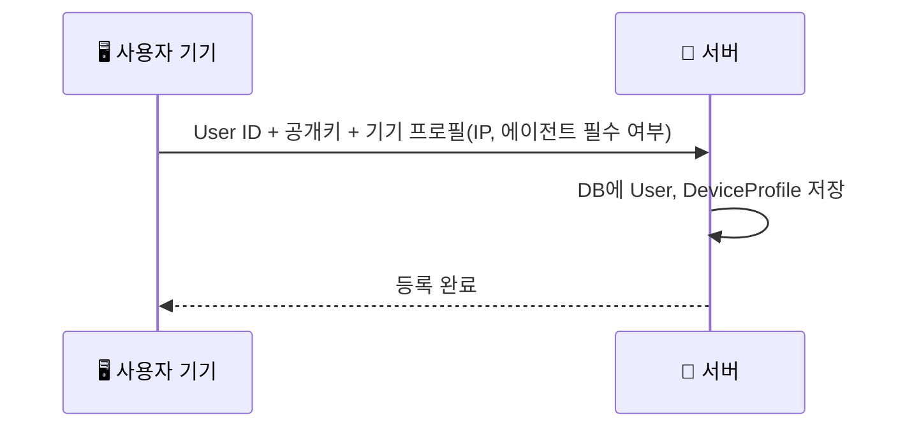
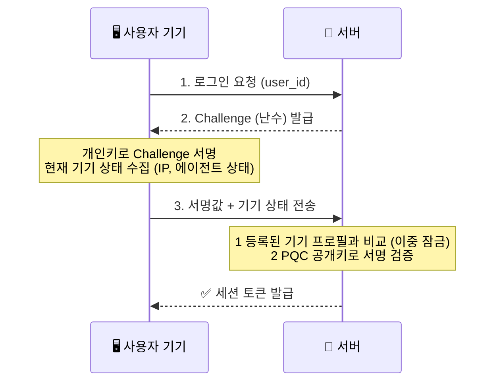
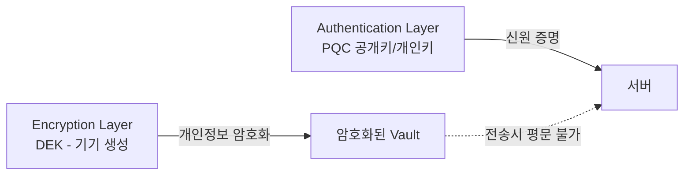

# 🔐 Zero Trust Auth — 양자 내성 패스키 인증 시스템

> 기존 비밀번호·SMS 2차 인증의 한계를 넘어,  
> **양자 내성 암호(PQC) + 기기 컨텍스트 검증**으로 구현한 Zero Trust 철학을 참고한 패스워드리스 인증 시스템

---

## 💡 왜 만들었나요?

| 기존 방식 | 취약점 |
|-----------|--------|
| 비밀번호 | 서버 DB 탈취 시 전체 계정 노출 |
| SMS 2차 인증 | AiTM 피싱 공격으로 우회 가능 |
| RSA/ECC 암호 | 양자 컴퓨터 등장 시 해독 가능 |
| 중앙 집중식 개인정보 DB | 서버 침해 시 전체 사용자 정보 일괄 유출 |

→ **서버는 공개키만 저장, 개인정보는 사용자 기기에 암호화 저장하는 자기주권형 구조**로 설계

---

## 🏗️ 시스템 아키텍처

### 1) 계정 생성 (기기 등록)


### 2) 로그인 (인증)


---

## 🔒 데이터 보호 계층 (Vault)

인증과 데이터 보호는 역할이 분리된 별도 계층으로 동작합니다.

| 계층 | 역할 | 키 |
|------|------|-----|
| Authentication Layer | 신원 증명 (로그인) | PQC 공개키/개인키 |
| Encryption Layer | 개인정보 보호 (저장) | DEK (Data Encryption Key, 기기에서 생성) |

DEK는 사용자의 두 번째 개인키가 아니라, Envelope Encryption에서 착안한 데이터 암호화 전용 키입니다.
브라우저에서 생성되어 서버로 전송되지 않으며, 서버는 암호화된 vault만 전달받아 평문 데이터를 알 수 없습니다.



---

## 🗺️ 개발 로드맵

- [x] **Phase 1-1** — FastAPI 챌린지-응답 인증 서버 구현
- [x] **Phase 1-2** — 양자 내성 암호(PQC) 키 쌍으로 교체
- [x] **Phase 1-3** — 기기 컨텍스트 검증 기반 이중 잠금 추가
- [x] **Phase 1-3-확장** — 유저별 기기 프로필 DB(SQLite) 기반 이중 잠금으로 고도화
- [x] **Phase 1-4** — React 실시간 모니터링 대시보드
- [x] **Phase 1-5** — ECC vs PQC 연산 오버헤드 정량 벤치마크
- [x] **Phase 2-1** — 클라이언트 개인정보 DEK 기반 암호화 저장 (Vault) — 서버 DB 다이어트
- [x] **Phase 2-2** — 분산 서비스 검증 파이프라인 — 서버는 검증만, 메모리 처리 후 즉시 삭제
- [x] **Phase 3-1** — 공개키 교체 공격 방어 (기존 기기 서명 없이 공개키 변경 불가) + 감사 로그(Audit Log) 해시체인
- [x] **Phase 3-1-확장** — Auth DB / Audit Log 분리 (인증 이력 별도 테이블로 분리)
- [x] **Phase 3-2** — Context Integrity 서명 (컨텍스트 위변조 방지)
- [x] **Phase 3-3** — Oracle Attack 방어 (에러 메시지 통일)
- [x] **Phase 3-4** — 비동기 처리 개선 (PQC 연산 run_in_threadpool)
- [x] **Phase 3-5** — 위협 모델 문서화, WebAuthn/FIDO2 비교 분석

---

## 🛠️ 기술 스택

| 영역 | 기술 |
|------|------|
| Backend | Python 3.12, FastAPI, uvicorn |
| Database | SQLite (SQLAlchemy ORM) |
| 암호화 | ECC (SECP256R1) → ML-DSA (Dilithium2, NIST 표준 PQC 알고리즘) |
| Frontend | React, Vite, CSS Modules |
| 인증 방식 | Passwordless Challenge-Response + 유저별 기기 컨텍스트 검증 (이중 잠금) |

---

## 🚀 로컬 실행 방법

```bash
# 1. 가상환경 활성화
source venv/Scripts/activate

# 2. 백엔드 서버 실행 (이중 잠금 + PQC 인증)
uvicorn backend.context_auth:app --reload --port 8002

# 3. 프론트엔드 실행 (새 터미널)
cd frontend
npm run dev

# 4. 브라우저에서 확인
# http://localhost:5173
```

---

## 📊 벤치마크 결과 (100회 반복 평균)

| 항목 | ECC (SECP256R1) | ML-DSA (Dilithium2) | 배율 |
|------|------|--------|------|
| 키 생성 | 0.033ms | 0.137ms | 4.2배 |
| 서명 | 0.142ms | 0.164ms | 1.2배 |
| 검증 | 0.052ms | 0.077ms | 1.5배 |
| 공개키 크기 | 65 bytes | 1312 bytes | 20.2배 |
| 서명 크기 | 70 bytes | 2420 bytes | 34.6배 |

**결론:**
연산 속도는 ECC와 큰 차이가 없지만(1.2-1.5배), 키와 서명 크기는 20-35배 커짐.
크기 증가는 네트워크 트래픽과 저장 공간에 영향을 주지만, 양자 컴퓨터 공격에 대한 내성을 확보하는 비용으로는 합리적인 수준.

벤치마크 코드: [backend/benchmark.py](./backend/benchmark.py)

---

## 🛡️ 위협 모델

### 가정하는 공격자
- 서버 DB에 접근 가능한 공격자 (서버 침해 시나리오)
- 네트워크 트래픽을 가로채는 공격자 (MitM)
- 인증 응답을 분석해서 힌트를 얻으려는 공격자 (Oracle Attack)

### 막을 수 있는 것
| 공격 | 방어 수단 |
|------|------|
| 서버 DB 탈취로 개인정보 유출 | Vault — 개인정보는 서버 DB에 없음 |
| 공개키 교체로 계정 탈취 | /rotate-key — 기존 개인키 서명 없이 교체 불가 |
| 전송 중 기기 상태 변조 | Context Integrity 서명 — 챌린지+기기 상태 함께 서명 |
| 에러 메시지로 공격 힌트 획득 | Oracle Attack 방어 — 모든 실패를 동일 메시지로 통일 |
| 양자 컴퓨터 기반 서명 위조 | ML-DSA (Dilithium2) — NIST 표준 PQC 알고리즘 |

### 막을 수 없는 것 (현재 구조의 한계)
- 개인키가 서버 메모리에 있어서 서버가 완전히 장악되면 개인키 탈취 가능
- TPM/Secure Enclave 수준의 하드웨어 기반 키 보호는 미구현
- 클라이언트 기기 자체가 물리적으로 탈취된 경우

---

## 🔑 WebAuthn/FIDO2와의 차이

| 항목 | WebAuthn/FIDO2 | Zero Trust Auth |
|------|------|------|
| 목적 | 클라이언트 인증 강화 | 서버 침해 이후 사용자 보호 |
| 개인키 위치 | 클라이언트 기기 (하드웨어) | 서버 메모리 (시뮬레이션) |
| 암호 알고리즘 | ECDSA, RSA | ML-DSA (PQC) |
| 양자 내성 | 없음 | 있음 |
| 개인정보 저장 | 서버 DB | 클라이언트 기기 (DEK 암호화) |
| 서버 침해 시 | 공개키 노출 | 개인정보 없음, 공개키 교체 방어 |

WebAuthn/FIDO2는 "클라이언트가 안전하게 인증하는 것"에 집중하고, 이 프로젝트는 "서버가 침해되더라도 사용자 피해를 최소화하는 것"에 집중합니다. 두 접근은 서로 다른 문제를 풀고 있으며, 실제 프로덕션 환경에서는 두 가지를 결합하는 것이 이상적입니다.