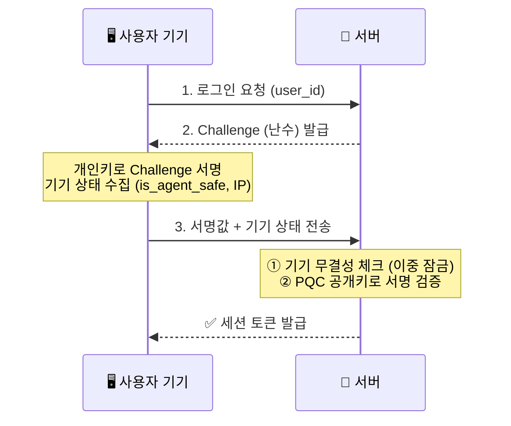

# 🔐 Zero Trust Auth — 양자 내성 패스키 인증 시스템

> 기존 비밀번호·SMS 2차 인증의 한계를 넘어,  
> **양자 내성 암호(PQC) + 기기 무결성 검증**으로 구현한 차세대 Zero Trust 인증 시스템

---

## 💡 왜 만들었나요?

| 기존 방식 | 취약점 |
|-----------|--------|
| 비밀번호 | 서버 DB 탈취 시 전체 계정 노출 |
| SMS 2차 인증 | AiTM 피싱 공격으로 우회 가능 |
| RSA/ECC 암호 | 양자 컴퓨터 등장 시 해독 가능 |

→ **서버는 공개키만 저장, 개인키는 절대 서버에 전송하지 않는 구조**로 설계

---

## 🏗️ 시스템 아키텍처



---

## 🗺️ 개발 로드맵

- [x] **Phase 1-1** — FastAPI 챌린지-응답 인증 서버 구현
- [x] **Phase 1-2** — 양자 내성 암호(PQC) 키 쌍으로 교체
- [x] **Phase 1-3** — 기기 무결성 컨텍스트 이중 잠금 추가
- [x] **Phase 1-4** — React 실시간 모니터링 대시보드
- [x] **Phase 1-5** — 동시성 부하 테스트 및 ECC vs PQC 연산 오버헤드 정량 분석
- [ ] **Phase 2** — 서버 DB 다이어트 + 자기주권형 분산 데이터 구조

---

## 🛠️ 기술 스택

| 영역 | 기술 |
|------|------|
| Backend | Python 3.12, FastAPI, uvicorn |
| 암호화 | ECC (SECP256R1) → ML-DSA (Dilithium2, NIST 표준 PQC 알고리즘) |
| Frontend | React, Vite, CSS Modules |
| 인증 방식 | Passwordless Challenge-Response + 기기 무결성 이중 잠금 |

---

## 🚀 로컬 실행 방법

```bash
# 1. 가상환경 활성화
source venv/Scripts/activate

# 2. 백엔드 서버 실행 (이중 잠금 + PQC 인증)
uvicorn backend.context_auth:app --reload --port 8002

# 3. 프론트엔드 실행 (새 터미널)
cd frontend
npm run dev

# 4. 브라우저에서 확인
# http://localhost:5173
```

---

## 📊 벤치마크 결과 (100회 반복 평균)

| 항목 | ECC (SECP256R1) | ML-DSA (Dilithium2) | 배율 |
|------|------|--------|------|
| 키 생성 | 0.033ms | 0.137ms | 4.2배 |
| 서명 | 0.142ms | 0.164ms | 1.2배 |
| 검증 | 0.052ms | 0.077ms | 1.5배 |
| 공개키 크기 | 65 bytes | 1312 bytes | 20.2배 |
| 서명 크기 | 70 bytes | 2420 bytes | 34.6배 |

**결론:**
연산 속도는 ECC와 큰 차이가 없지만(1.2-1.5배), 키와 서명 크기는 20~35배 커짐.
크기 증가는 네트워크 트래픽과 저장 공간에 영향을 주지만, 양자 컴퓨터 공격에 대한 내성을 확보하는 비용으로는 합리적인 수준.

벤치마크 코드: [backend/benchmark.py](./backend/benchmark.py)